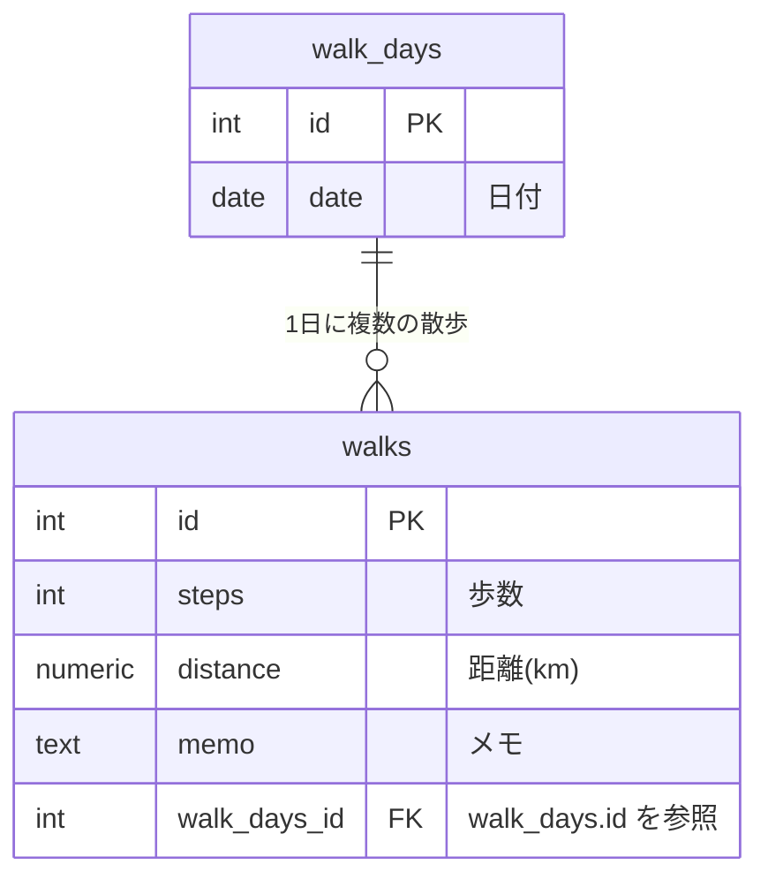

# 散歩DB ER図

```mermaid
erDiagram
    walk_days ||--o{ walks : "1日に複数の散歩"

    walk_days {
        int  id   PK
        date date "日付"
    }

    walks {
        int    id          PK
        int    steps       "歩数"
        numeric distance    "距離(km)"
        text   memo        "メモ"
        int    walk_days_id FK "walk_days.id を参照"
    }
```

## リレーション

| 親 | 子 | 種類 | 結合キー |
|---|---|---|---|
| walk_days | walks | 1対多 | walks.walk_days_id → walk_days.id |
